# NIKE'S NEXT RUN

## Integrated Three-Statement Model, Scenario Analysis and Valuation

**Developed by Daniel Sibanda**

This independent portfolio case study examines what must become true operationally for NIKE's turnaround to create sustainable shareholder value.

## Model Coverage

- Integrated income statement, balance sheet and cash flow statement
- FY2022A-FY2026A audited historical data
- FY2027F-FY2031F forecasts
- Driver-based scenario analysis
- Detailed working-capital, capex, depreciation, tax, debt and equity schedules
- DCF and sensitivity analysis
- Trading comparable-company analysis
- Precedent-transaction analysis
- Floating valuation football field
- Hypothetical investment appraisal using NPV and XIRR
- Model checks, circularity control and source register

## Base-Case Outputs

| Metric | Output |
|---|---:|
| FY2031 Revenue | $59.5 billion |
| FY2031 EBIT | $7.6 billion |
| FY2031 Unlevered FCF | $6.0 billion |
| DCF Value per Share | $57.20 |
| DCF Sensitivity Range | $47.18-$77.49 |
| Hypothetical Project NPV | $1.23 billion |
| Hypothetical Project XIRR | 34.9% |

## Modelling Standards

- Hardcoded inputs appear in blue
- Formulas appear in black
- Negative figures appear in parentheses
- Actual and forecast periods are clearly identified
- Assumptions are supported by source notes
- Model checks and control switches remain visible
- Forecast assumptions are separated from reported results

## Primary Sources

- [NIKE FY2026 Form 10-K](https://www.sec.gov/Archives/edgar/data/320187/000032018726000088/nke-20260531.htm)
- [NIKE FY2026 Results](https://www.sec.gov/Archives/edgar/data/320187/000032018726000076/q4fy26exhibit991er.htm)
- [adidas FY2025 Financial Highlights](https://report.adidas-group.com/2025/en/at-a-glance/financial-highlights-2025.html)
- [PUMA FY2025 Annual Report](https://annual-report.puma.com/2025/en/additional-information/puma-group-development/index.html)
- [U.S. Treasury Interest-Rate Data](https://home.treasury.gov/resource-center/data-chart-center/interest-rates/)
- [Damodaran Market Data](https://pages.stern.nyu.edu/~adamodar/)

Additional assumption and transaction sources are documented within the workbook.

## Disclaimer

This is an independent educational portfolio case study developed by Daniel Sibanda using publicly available information. It is not affiliated with, commissioned by or endorsed by NIKE, Inc.

"Next Run" is a hypothetical strategic initiative. All forecasts, scenarios and valuations represent independent analyst estimates, not NIKE management guidance or investment advice. All company names and trademarks belong to their respective owners.

## Model Preview

The following screenshots demonstrate the workbook's executive dashboard, scenario controls, integrated financial statements, supporting schedules and valuation outputs.

  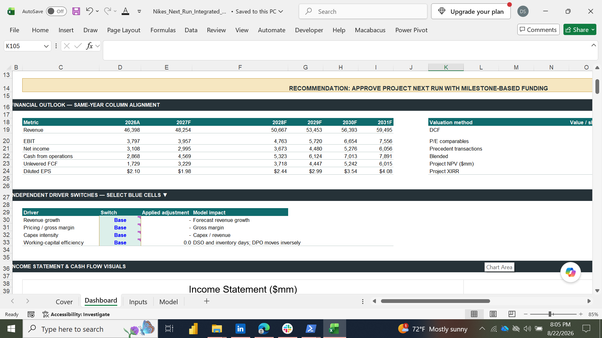
  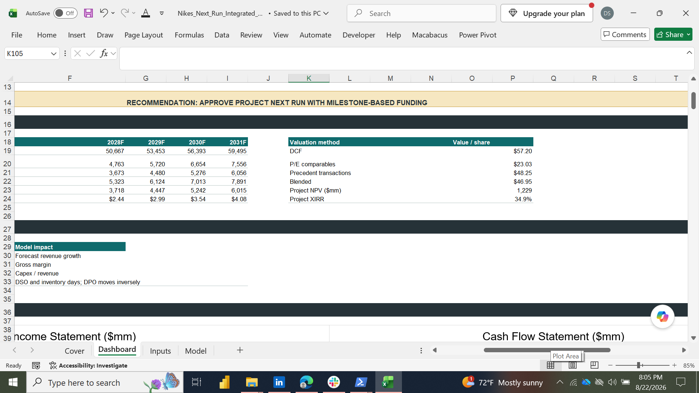

  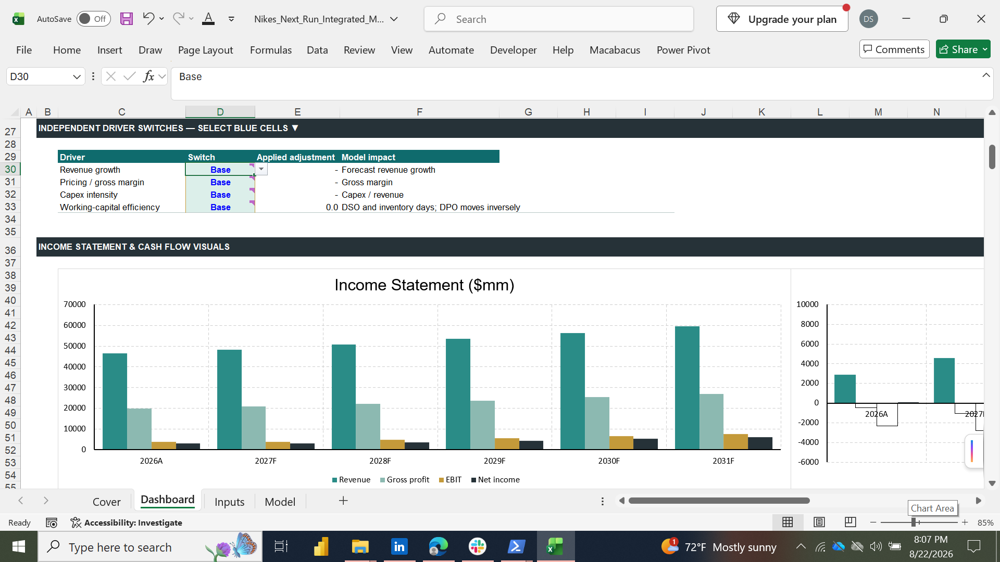
  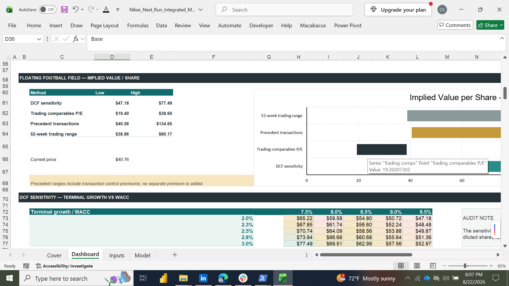

  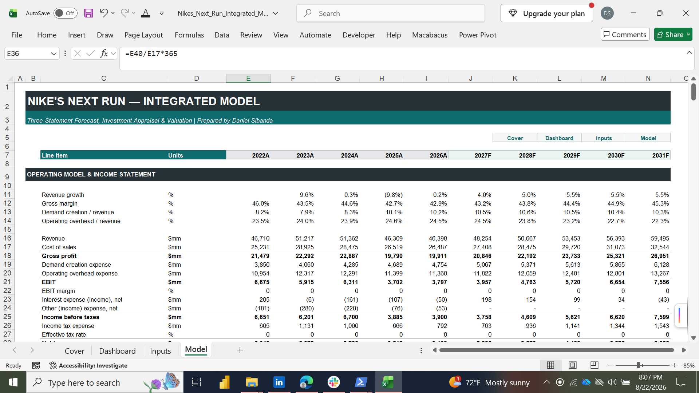
  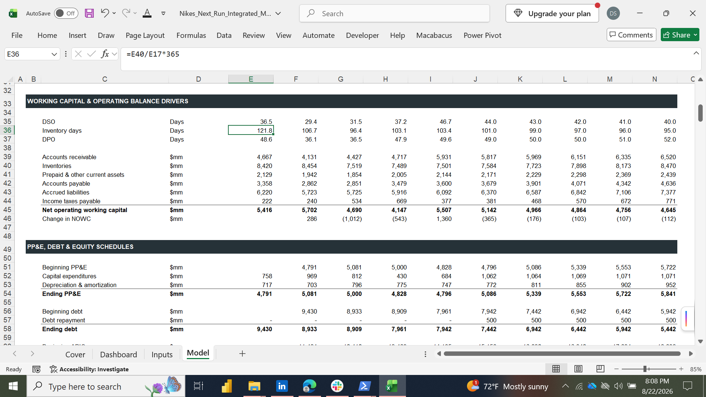

  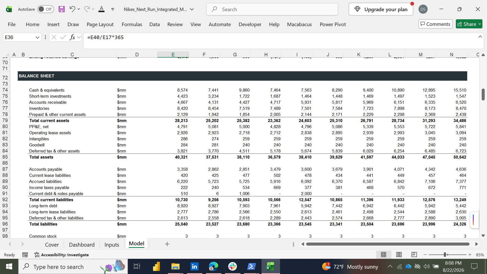
  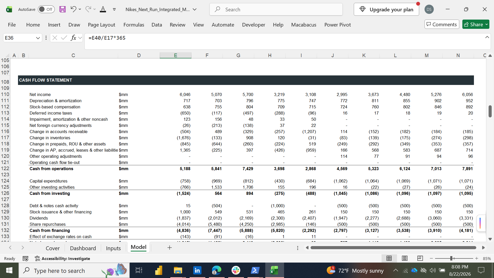

  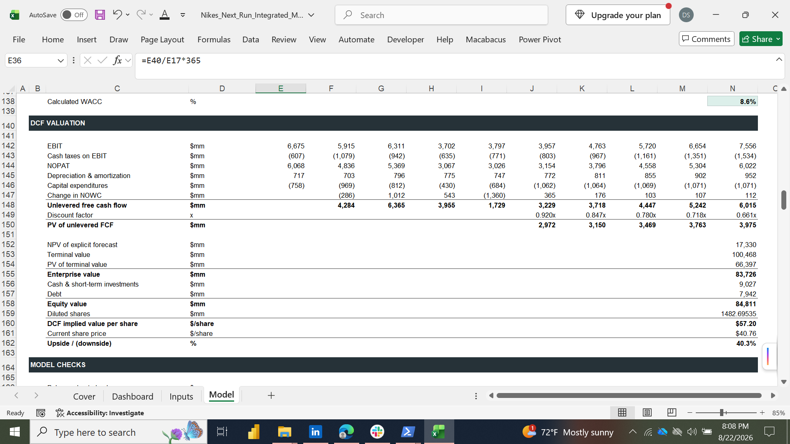
  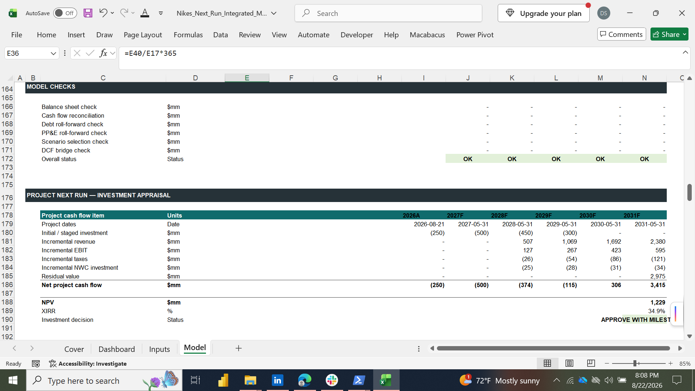

  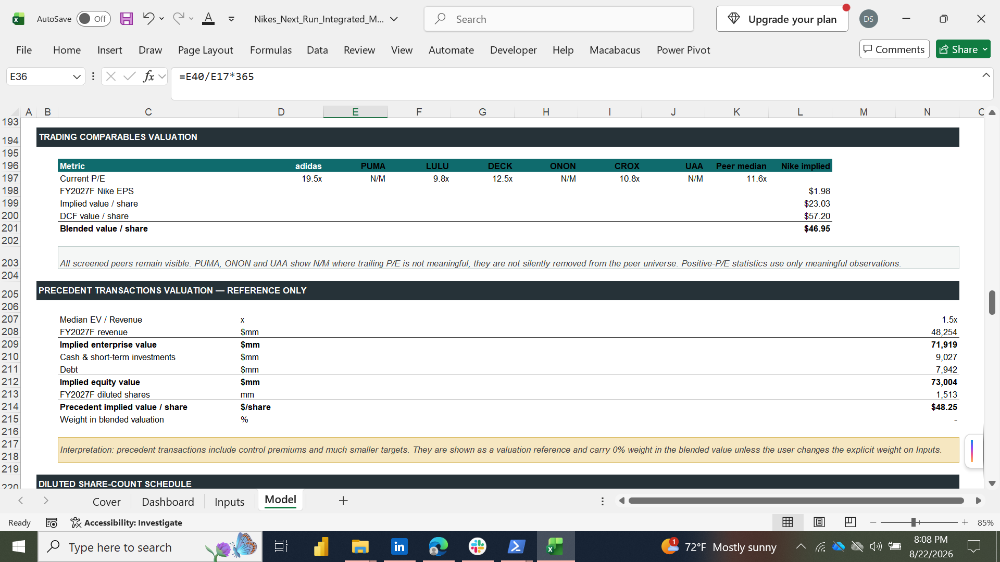

